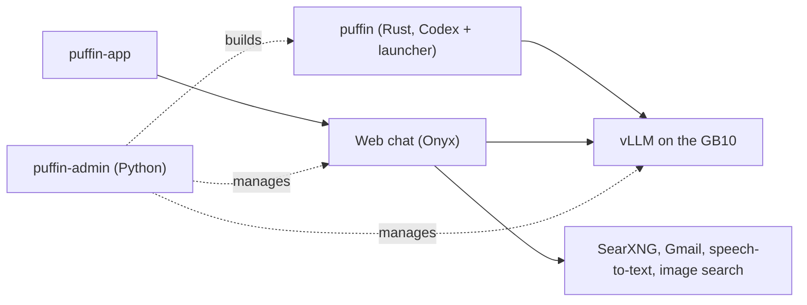

<div align="center">


# Puffin

**OpenAI's Codex CLI, running an open model on the desk in front of you.**

No cloud model. No OpenAI account. No phone-home. An air-gapped mode when you want one.

[](docs/getting-started.md)
[](docs/puffin.md)
[](LICENSE)

</div>

```console
$ puffin-admin server start        # load Qwen3.8-27B on your GB10
$ cd ~/my-project && puffin        # and code with it

>_ Puffin (v0.158.0)
model: RadixArk/Qwen3.8-27B-NVFP4
```

Puffin, by **Dreamference**, is a local AI stack for the NVIDIA GB10. It gives you a
terminal coding agent, a browser chat assistant and a desktop app, all answered by one model
served on your own machine. Your code, your prompts and your conversations stay there.

---

## What you get

| Surface | What it does |
|---|---|
| **`puffin`, the terminal agent** | Reads your code, runs commands, edits your repository. It *is* the Codex CLI, so `puffin exec`, `puffin resume --last`, `-c key=value` and the slash commands work as you know them. [More →](docs/puffin.md) |
| **Web chat** | A browser assistant with web search, voice input, image understanding and read-only Gmail, on the same local model. [More →](docs/web-chat.md) |
| **`puffin-app`** | The web chat in a window of its own, with a launcher entry and icon, and a Work window that drives `puffin` sessions with approvals, diffs and undo. [More →](docs/desktop.md) |

## Why it is interesting

**A fork that edits almost nothing.** Codex lives in [`codex/`](codex) as a submodule pinned to the
`rust-v0.158.0` release, and it is never modified. At build time Puffin exports that source, adds
its launcher crate ([`puffin-rs/`](puffin-rs)) and applies **21 patches totalling 37 KB** from
[`codex-patches/`](codex-patches), touching 37 of Codex's files. Most patches are a line or two: a
hook that calls Puffin's own code, or a switch that turns a cloud feature off. Moving to a new Codex
release is a submodule bump plus whichever hunks stop applying.

**Every phone-home channel found by tracing, closed at the source.** Codex is built for OpenAI's cloud, and several of
its calls happen with no login and no command from you. Puffin removes them at the source, in the
patches, so no config file or sign-in can turn them back on:

| Channel | Where it went | How Puffin closes it |
|---|---|---|
| Usage analytics | `chatgpt.com/backend-api/codex/analytics-events` | Analytics client built disabled (`0013`) |
| OpenTelemetry metrics, on by default in release builds | `ab.chatgpt.com` (Statsig) | Exporter resolves to none (`0015`) |
| Curated-plugin sync at startup | `github.com/openai/plugins.git` | Startup sync removed (`0015`) |
| "Featured plugins" list | `chatgpt.com/backend-api/plugins/featured` | Returns an empty list (`0015`) |
| Announcement tips in the TUI | `raw.githubusercontent.com/openai/codex` | Never fetched (`0015`) |
| A ChatGPT sign-in left by upstream Codex | `~/.codex/auth.json` | Puffin uses its own `~/.puffin` (`0014`) |
| Anything missed | `chatgpt_base_url` | Pointed at a closed local port by the launcher |

These were found by tracing real sessions (`strace` on every `connect()` and `execve()`), not by
reading code, and re-running that trace is part of the checklist for every Codex upgrade. `login`, `cloud`,
`remote-control`, `/feedback` and `/voice` are refused or hidden; `update` installs Puffin releases
instead of OpenAI's. The full list is in [`specs/DREAMFERENCE_PUFFIN_CODEX.md`](specs/DREAMFERENCE_PUFFIN_CODEX.md).

**A big model that does not take the machine down with it.** On the GB10 the GPU and the operating
system share one pool of memory, so an oversized model load does not just fail: it freezes the
whole machine. That happened six times in one hour on 14 August. Since then, `puffin-admin server
start` checks swap, kernel settings and the out-of-memory guard before it loads anything, and a
watchdog reads kernel memory-pressure stall data during the load and kills the container before
the host locks up. [How →](docs/architecture.md)

## What does leave your machine

Local is not the same as air-gapped, and Puffin does not pretend otherwise. These are the only
things that reach the network, and each happens because you or the agent asked for it:

| When | What is sent | To |
|---|---|---|
| Installing, building, first model start | Container images, packages, model weights, the Rust toolchain | Docker registries, PyPI, crates.io, Hugging Face, GitHub |
| The agent or chat searches the web | The search query | Search engines, through a SearXNG instance on your machine |
| The agent fetches a page | A request for that URL | That website |
| You connect Gmail, Drive or Calendar | Read-only requests for your mail, files or events | Google |
| You run `puffin update` | A release check and download | GitHub |

Search queries are written by the model and can contain fragments of your context. Type
`/airgapped on` in a session (or set `puffin_airgapped = "on"`) and every command the agent runs
gets an empty network namespace: no search, no fetch, no mail, only the model on your machine.
Gmail alone can be switched off with `puffin_gmail = false`. Details:
[Privacy & security](docs/privacy.md).

## Quick start

**You need** an NVIDIA GB10 with 128 GB of unified memory running arm64 Ubuntu, Docker with the
NVIDIA Container Toolkit, Python 3 and Git. Expect about 70 GB of model weights on first start, an
8–12 minute kernel compile the first time the server loads, and a Rust build of `puffin` that takes
a few minutes once its dependencies are cached, much longer the first time.

**Install from a release** (no checkout, nothing compiled). [`install.sh`](install.sh) is attached
to every release; it downloads that release's prebuilt binaries, checks them against the release's
checksums, and on a GB10 also installs `puffin-admin` and applies the host settings a model load
needs (it prints each `sudo` command before running it):

```bash
curl -fsSLO https://github.com/dgxcoder/dgxcoder/releases/latest/download/install.sh
bash install.sh                      # read it first if you like: it is short
puffin-admin server start            # checks the host, downloads and loads the model
cd ~/my-project && puffin            # start coding
```

On any other Linux machine the same script installs only the client (`puffin` and its commands).
Installed this way, `puffin update` moves to a newer release.

**Or from a checkout**, which is what you want for changing Puffin itself:

```bash
git clone --recurse-submodules https://github.com/dgxcoder/dgxcoder.git puffin
cd puffin
python3 -m venv .venv && .venv/bin/pip install -e .
export PATH="$PWD/.venv/bin:$PATH"   # add to ~/.bashrc: the agent runs puffin-admin for web search

puffin-admin host setup              # swap, sysctls, earlyoom, sysstat: what a model load needs
puffin-admin server start            # checks the host, downloads and loads the model
puffin-admin codex build             # compiles puffin and links it into ~/.local/bin
cd ~/my-project && puffin            # start coding
```

`puffin-admin`, `puffin-search` and `puffin-fetch` have to be on the `PATH` the agent inherits: it reaches the web
and Gmail by running `puffin-search`, `puffin-fetch` and `puffin-admin gmail` as shell commands. The default model runs on a
published SGLang image that `server start` pulls; the 122B fallbacks need a custom vLLM image, built
in two stages from [`Dockerfile.dflash`](Dockerfile.dflash) and [`Dockerfile.dense`](Dockerfile.dense),
which `server start` cannot build for you yet. The full walkthrough, including the web chat and
desktop app, is in [Get started](docs/getting-started.md).

## Models

Choosing a model chooses its whole server recipe: context length, memory share, kernels,
speculative decoding. There is nothing to tune by hand.

| Alias | Model | Precision | Memory |
|---|---|---|---|
| **`qwen3.8-27b-nvfp4-dflash2`** (default) | Qwen3.8-27B with DFlash2 speculative decoding, served by SGLang | NVFP4 | 20 – 70 GB |
| `qwen3.5-122b-a10b-hybrid-dflash` (fallback) | Qwen 3.5 122B-A10B with DFlash speculative decoding | INT4 + FP8 | 71.5 – 120 GB |
| `qwen3.5-122b-a10b-int4-dflash` | Qwen 3.5 122B-A10B with DFlash | INT4 | 71.5 – 120 GB |
| `qwen3.5-122b-a10b-nvfp4` | Qwen 3.5 122B-A10B | NVFP4 | 78 – 120 GB |
| `qwen3.6-35b-a3b-nvfp4` | Qwen 3.6 35B-A3B | NVFP4 | 25 – 60 GB |

The default model measures **25.5 tokens/s on prose, 50.3 on code and 87.0 on JSON** on a GB10,
single-stream, with a **262K-token context**. A small drafter proposes 16 tokens at a time and the
model checks them in one pass, which is why structured output is faster than prose. Four agents
working at once are no problem: memory stays well clear of the limit.
[All models →](docs/models.md)

## Configuration

Every setting resolves the same way: command-line flag, then `DREAMFERENCE_*` environment variable,
then `dreamference.toml` (in the project, then `~/.config/dreamference/config.toml`), then the
built-in default.

```toml
# dreamference.toml
vllm_host = "http://localhost:8000"
model = "qwen3.8-27b-nvfp4-dflash2"
agent_runner = "codex"      # codex is `puffin`; also cline, continue, openhands
puffin_gmail = true         # let the agent read connected Gmail accounts
```

## Other agents

`puffin` is the default, but the same server can drive Cline, Continue or OpenHands:

```bash
puffin-admin run --agent cline "add type hints to utils.py"
```

## Architecture



`puffin-admin` is the Python CLI from the `dreamference` package: it starts the model server,
deploys the web chat, builds `puffin` and runs the other agents. Full command reference:
[`docs/admin.md`](docs/admin.md). Design specs: [`specs/`](specs/README.md).

## Development

```bash
.venv/bin/pip install -e .
.venv/bin/python -m pytest tests/        # no GPU or Docker needed; live tests skip without a server
puffin-admin codex build                 # rebuild puffin after changing puffin-rs/ or codex-patches/
```

Tests never touch your real configuration: each one gets its own home directory. The live
slash-command suite (`tests/test_puffin_slash_commands.py`) drives every Codex slash command
against a running model when one is up.

## License

Copyright (C) 2026 Dreamference contributors.

Puffin is free software: you can redistribute it and/or modify it under the terms of the
**GNU Affero General Public License** as published by the Free Software Foundation, either version
3 of the License, or (at your option) any later version. The full text is in [`LICENSE`](LICENSE).

The AGPL's [section 13](LICENSE) is the clause that distinguishes it from the GPL: if you run a
modified version and let users interact with it **over a network**, those users must be offered the
corresponding source. Puffin ships a browser chat UI, so that clause is the operative one for
anyone hosting a fork.

This covers Puffin's own code. The components it deploys keep their own licences: Codex
(Apache 2.0), vLLM (Apache 2.0), Onyx (its own terms, including an `ee/` directory that is *not*
free software and which Puffin deliberately leaves switched off), and the models, each under
the terms of its own weights licence.

## Contributing

Issues and pull requests are welcome, especially GB10 recipes for new models, and anything the
network trace turns up after a Codex upgrade. If Puffin is useful to you, a star helps other GB10
owners find it.
