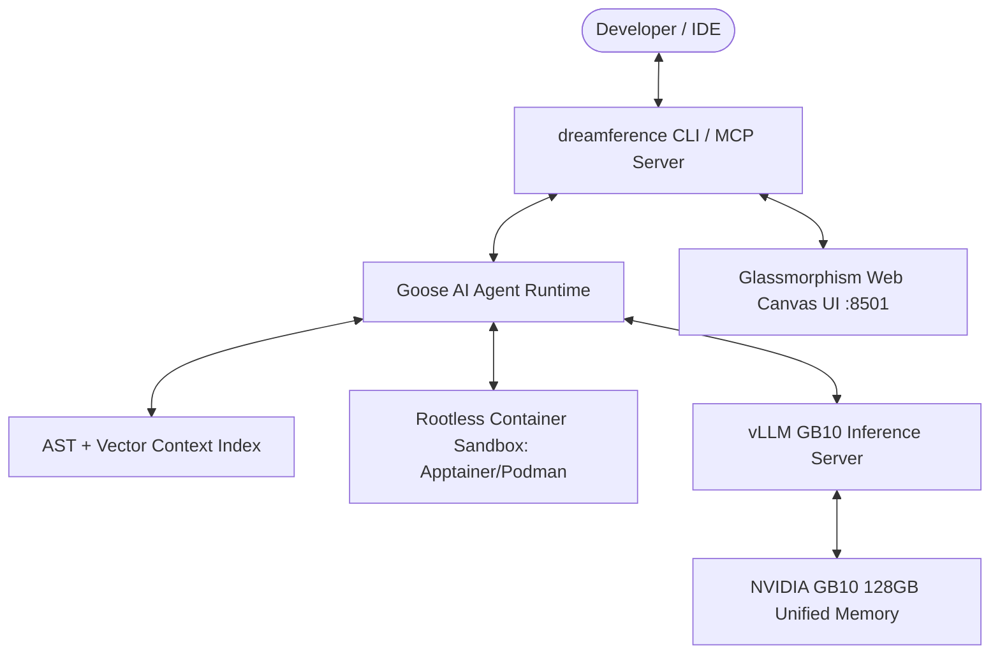

<div align="center">


# 🚀 Dreamference

### **The Ultimate Autonomous AI Pair Programmer for NVIDIA GB10 Blackwell**

[](https://nvidia.com)
[](https://github.com/aaif-goose/goose)
[](https://github.com/vllm-project/vllm)
[](LICENSE)
[](https://dreamference.github.io/dreamference)
[](tests/)

<p align="center">
  <b>100% Air-Gapped. Zero Data Egress. Blazing Fast Speculative Decoding. Enterprise Container Sandboxing.</b>
</p>

---

</div>

## 🌟 What is Dreamference?

**Dreamference** is a state-of-the-art, open-source local AI pair programmer designed specifically to harness the massive **128 GB Unified LPDDR5X Memory** architecture of single-node **NVIDIA GB10 (Blackwell)** systems. 

Powered by the **AAIF Goose Agentic Engine** and **vLLM Dual-Model Speculative Decoding**, Dreamference turns your local GB10 workstation into an autonomous software engineering powerhouse capable of writing code, running unit tests, refactoring multi-file repositories, and resolving bugs with zero network egress.

---

## 🏆 Why Dreamference?

*   **🛡️ Absolute Sovereignty**: 100% local execution. Your code never leaves your NVIDIA GB10 workstation. Perfect for high-security enterprise and proprietary environments.
*   **⚡ Blackwell Optimized**: Custom vLLM launch recipes tuned specifically for the GB10 (SM121) architecture, leveraging **FlashInfer** and **NVFP4** quantization.
*   **🤖 Multi-Agent Freedom**: Use the default **Goose** agent or switch seamlessly to **Aider**, **Cline**, **Continue**, or **OpenHands** with a single flag.
*   **📚 Deep Context Intelligence**: Air-gapped AST symbol indexing combined with hybrid TF-IDF and dense vector search for lightning-fast codebase navigation.
*   **🚀 Insane Speed**: Achieve 2x-3x higher throughput with dual-model speculative decoding and Blackwell-optimized kernels.

---

## 🔥 Features at a Glance

* ⚡ **Dual-Model Speculative Decoding**: Run primary 32B/70B models (`Qwen 2.5 Coder 32B`, `DeepSeek-R1-Distill`) alongside lightweight draft models (`Qwen 2.5 Coder 1.5B/3B`) to achieve **2x–3x faster inference throughput**.
* 🤖 **Goose Agentic Loop**: Built-in supervisor that auto-provisions and orchestrates the official **AAIF Goose v1.45+** AI agent runtime out of the box.
* 🛡️ **Rootless Container Sandboxing**: Isolate subagent tool executions (shell commands, package installs, test runs) using **Apptainer**, **Podman**, or **Docker** rootless containers.
* 📚 **Zero-Egress AST Context Engine**: Air-gapped code intelligence combining AST symbol parsing (classes, functions, signatures) with TF-IDF semantic vector search (`.dreamference/context_index.json`).
* 🔌 **IDE Companion MCP Server**: Native stdio **Model Context Protocol (MCP)** server providing real-time linter diagnostics, active editor sync, and diff proposals for **JetBrains** & **VS Code**.
* 🎨 **Glassmorphism Web Canvas UI**: Interactive browser pane (`http://localhost:8501`) featuring live Mermaid.js architecture diagrams, streaming code diffs, and real-time GB10 memory telemetry.

---

## ⚡ Quickstart (Instant Setup)

### 1-Line Automatic Installer:
```bash
curl -fsSL https://raw.githubusercontent.com/dreamference/dreamference/main/scripts/install_gb10.sh | bash
```

### Launch Interactive Pair Programming:
```bash
# Initializes workspace, auto-launches local vLLM server, and starts Goose agent session
puffin-admin chat
```

---

## 🖥️ NVIDIA GB10 Model Qualification Matrix

All supported models are qualified to run on a single **NVIDIA GB10 System (128 GB Unified Memory)**:

| Model Alias | Parameters | Precision | Memory Required | Hardware Qualification |
| :--- | :--- | :--- | :--- | :--- |
| **`qwen3.6-35b-a3b-nvfp4`** | 35B (3B active) | NVFP4 | ~25 - 60 GB | ✅ **Default**. GB10 optimized MoE |
| **`qwen2.5-coder-32b`** | 32B | BF16 / FP8 | ~35 - 64 GB | ✅ Fits comfortably in 128GB Unified Memory |
| **`qwen2.5-coder-72b`** | 72B | INT8 / FP8 | ~45 - 80 GB | ✅ Supported (Quantized fit) |
| **`deepseek-r1-distill-32b`** | 32B | BF16 / FP8 | ~35 - 64 GB | ✅ Fits comfortably in 128GB Unified Memory |
| **`deepseek-r1-distill-70b`** | 70B | INT8 / FP8 | ~45 - 80 GB | ✅ Supported (Quantized fit) |
| **`llama-3.3-70b`** | 70B | FP8 | ~75 GB | ✅ Supported (Quantized fit) |
| **`qwen2.5-coder-1.5b`** | 1.5B | BF16 | ~3.5 - 6 GB | ✅ Ideal Speculative Decoding Draft Model |
| **`qwen2.5-coder-3b`** | 3.0B | BF16 | ~6.5 - 10 GB | ✅ Ideal Speculative Decoding Draft Model |
| **`starcoder2-15b`** | 15B | BF16 / FP16 | ~20 - 30 GB | ✅ Fits easily |
| `deepseek-v3-671b` | 671B | INT4 | ~350 GB | ❌ Exceeds 128GB (Requires multi-node) |


---

## ⚙️ vLLM Parameters for Default Model (`qwen3.6-35b-a3b-nvfp4`)

Dreamference automatically applies an optimized **NVIDIA GB10 launch recipe** when starting the default model (`qwen3.6-35b-a3b-nvfp4` / `nvidia/Qwen3.6-35B-A3B-NVFP4`):

| Parameter / Flag | Value | Function |
| :--- | :--- | :--- |
| **Docker Image** | `nvcr.io/nvidia/vllm:26.07-py3` | Pinned NGC vLLM container with Blackwell SM121 support |
| **Context Length (`--max-model-len`)** | `131072` | 128K context window for large codebase context |
| **Memory Ratio (`--gpu-memory-utilization`)** | `0.3` | 30% memory utilization tuned for GB10 unified memory |
| **KV Cache Dtype (`--kv-cache-dtype`)** | `fp8` | FP8 quantized KV cache for high token capacity |
| **Attention Backend (`--attention-backend`)** | `flashinfer` | Blackwell-optimized FlashInfer attention kernels |
| **MoE Backend (`--moe-backend`)** | `flashinfer_b12x` | Blackwell-optimized FlashInfer b12x MoE backend |
| **Tool Parser (`--tool-call-parser`)** | `qwen3_xml` | Qwen 3.6 XML tool call parser |
| **Reasoning Parser (`--reasoning-parser`)** | `qwen3` | Qwen 3.6 reasoning channel parser |
| **Max Batched Tokens (`--max-num-batched-tokens`)** | `32768` | Batched tokens limit for chunked prefill |
| **Speculation (`--speculative-config`)** | `{"method": "mtp", "num_speculative_tokens": 3, "moe_backend": "triton"}` | MTP (Multi-Token Prediction) with 3 draft tokens and Triton backend |
| **Cache & Prefill** | `--enable-prefix-caching --enable-chunked-prefill` | Multi-turn prefix reuse & fast TTFT prefill chunking |
| **Container Environment (`-e`)** | `VLLM_NVFP4_GEMM_BACKEND=flashinfer-b12x`<br>`VLLM_MARLIN_USE_ATOMIC_ADD=1`<br>`VLLM_DISABLED_KERNELS=MarlinNvFp4LinearKernel` | Directs process to SM121 FlashInfer b12x NVFP4 GEMM kernels |

---


## 🛠️ CLI Suite & Commands

```bash
# 1. Initialize project workspace & Goose agent configuration
puffin-admin init --model qwen3.6-35b-a3b-nvfp4

# 2. Launch interactive pair-programming session (Auto-launches vLLM if offline)
puffin-admin chat --debug

# 3. Run autonomous coding task non-interactively
puffin-admin run "Refactor database pool to use async pg" --sandbox apptainer

# 4. Check GB10 memory telemetry & vLLM health
puffin-admin status

# 5. Launch local vLLM GB10 server with MTP Speculative Decoding
puffin-admin server start --model qwen3.6-35b-a3b-nvfp4 --port 8000

# 6. Index codebase AST & vector context
puffin-admin index --force

# 7. Start Web Canvas UI
puffin-admin web --port 8501
```

---

## ⚙️ Configuration & Precedence

Dreamference uses a **4-Tier Configuration Hierarchy**:
1. **CLI Flags**: `--config`, `--model`, `--draft-model`, `--sandbox` *(Highest Priority)*
2. **Environment Variables**: `DREAMFERENCE_MODEL`, `DREAMFERENCE_DRAFT_MODEL`, `DREAMFERENCE_SANDBOX`
3. **Config File**: `dreamference.toml` or `~/.config/dreamference/config.toml`
4. **Built-in System Defaults** *(Lowest Priority)*

### Example `dreamference.toml`:
```toml
vllm_host = "http://localhost:8000
model = "qwen3.6-35b-a3b-nvfp4
draft_model: null
num_speculative_tokens: 8
sandbox: apptainer
```

---

## 🏗️ Architecture Overview



---

## 📜 License

Copyright (C) 2026 Dreamference contributors.

Dreamference is free software: you can redistribute it and/or modify it under the terms of the
**GNU Affero General Public License** as published by the Free Software Foundation, either version
3 of the License, or (at your option) any later version. The full text is in [`LICENSE`](LICENSE).

The AGPL's [section 13](LICENSE) is the clause that distinguishes it from the GPL: if you run a
modified version and let users interact with it **over a network**, those users must be offered the
corresponding source. Dreamference ships a browser chat UI, so that clause is the operative one for
anyone hosting a fork.

This covers Dreamference's own code. The components it deploys keep their own licences — vLLM
(Apache 2.0), Onyx (its own terms, including an `ee/` directory that is *not* free software and
which Dreamference deliberately leaves switched off), and the models, each under the terms of its
own weights licence.

---

## 🤝 Community & Contribution

Dreamference is built by and for the **NVIDIA Blackwell** developer community. We believe in the power of open-source local AI.

*   **🐛 Found a Bug?**: Open an issue! We prioritize Blackwell-specific hardware issues and model compatibility.
*   **💡 Feature Request?**: We'd love to hear it. Multi-agent support and optimization recipes are our top focus.
*   **🌟 Star the Repo**: Help us make Dreamference viral!

---

<div align="center">
  <b>Built with ❤️ for NVIDIA GB10 & Blackwell AI Workstations</b>
</div>
