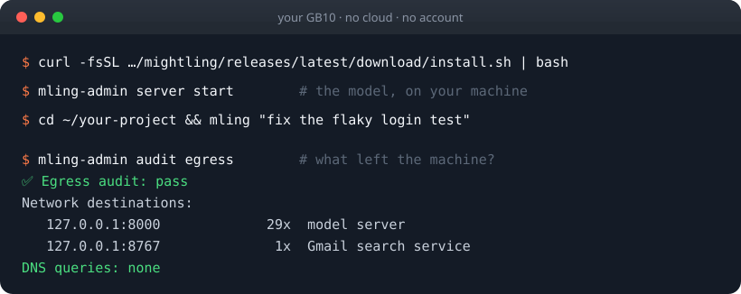

<div align="center">

<picture>
  <source media="(prefers-color-scheme: dark)" srcset="images/mightling-logo-dark-outlined.svg">
  
</picture>

## Private AI on your DGX Spark. One command.

**A fully local alternative to cloud coding agents.** A coding agent, a chat assistant and a desktop
app, running entirely on your own GB10. No cloud. No account. No API bill. No telemetry.

[**Install**](#install) · [**Try it**](#try-these-first) · [**Proof**](#-your-code-never-leaves-your-desk) · [**Docs**](docs/getting-started.md) · [**Releases**](https://github.com/dreamference/mightling/releases)

[](https://github.com/dreamference/mightling/releases/latest)
[](docs/privacy.md)
[](#runs-on-every-gb10)
[](https://github.com/dreamference/mightling/stargazers)
[](LICENSE)



| **0** | **87 tok/s** | **$0** | **262K** |
|:---:|:---:|:---:|:---:|
| phone-home connections, verified by `audit egress` | JSON on one GB10 | per token, forever | tokens of context |

</div>

## Install

```bash
curl -fsSL https://github.com/dreamference/mightling/releases/latest/download/install.sh | bash
```

On a GB10 you can start it and leave: it asks for your sudo password once, at the start (and
whether to install pending NVIDIA system updates), then sets up the host, offers the machine to your
local network, downloads the model (~20 GB) and starts serving it, and ends with a summary of every
step. Then point Mightling at a project:

```bash
cd ~/your-project && ling    # that's it
```

Works on the **NVIDIA DGX Spark** and every GB10 machine from Acer, ASUS, Dell, Gigabyte, HP, Lenovo
and MSI. The script verifies every download against the release's checksums and prints each `sudo`
command before running it. [Read it first](install.sh) if you like.

**On your laptop:** run the same one-liner on a Linux laptop (Intel/AMD or Arm) or a Mac (Apple
silicon or Intel). It installs the client, which uses the model on your GB10 over your network.
On a Mac there is also the desktop app, as a preview: the `-preview.dmg` on the release page. It
is not notarized, so macOS asks you to allow it once ([how](docs/desktop.md#on-a-mac-preview)).

Already using a coding agent? Paste this into it:

```text
Install Mightling on this GB10 from https://github.com/dreamference/mightling (one-line installer in the README), then run ling-admin server start.
```

## Try these first

```bash
ling "explain this repository to me like I'm new on the team"
ling "the tests are failing: find out why and fix them"
ling "add input validation to the signup form, with tests"
```

Or queue work for tonight, inside a session:

```text
/night add upgrade every dependency and fix whatever breaks
```

Mightling works through the queue while you sleep, each task on its own git branch. You review the
branches over coffee.

## Why switch

| | Cloud coding agents | Mightling |
|---|---|---|
| Where your code goes | Their servers | Nowhere |
| Account needed | Yes | No |
| Cost per token | Metered | Zero |
| Rate limits | Yes | No |
| Works with the network unplugged | No | Yes |
| You can verify what leaves | No | `ling-admin audit egress` |

---

## Why Mightling

### 🔒 Your code never leaves your desk

Cloud coding agents send your source code to someone else's servers. Mightling sends it nowhere: the
model runs on your GB10, and nothing in Mightling phones home. No usage analytics, no metrics, no
sign-in, no "anonymous" crash reports. That makes it usable for code you're not allowed to upload:
client work, regulated data, unreleased products.

**And you can prove it.** One command runs a real Mightling session under `strace` and lists every
network connection it made:

```console
$ ling-admin audit egress
✅ Egress audit: pass
Network destinations:
   127.0.0.1:8000             29x  model server
   127.0.0.1:8767              1x  Gmail search service
DNS queries: none
Networked git commands: none
```

Everything stayed on `127.0.0.1`. Not one DNS lookup.

Need a hard guarantee? Type `/airgapped on` and every command the agent runs gets an empty network
namespace from the Linux kernel. It isn't a polite request to the model: there is simply no network
to reach. [Privacy & security →](docs/privacy.md)

### ⚡ Fast, with no rate limits and no bill

| Single stream on a GB10 | |
|---|---|
| Code | **50 tokens/s** |
| JSON | **87 tokens/s** |
| Prose | **25 tokens/s** |
| Reading your code (prefill) | **~1,700 tokens/s** |
| Context window | **262K tokens** |

A small drafter proposes 16 tokens at a time and the model checks them in one pass, which is why
code comes out fastest. Run four agents at once and they all keep going: no quota, no "please wait",
nothing to pay per token, ever.

### ✨ Nothing to configure

- **No tuning.** The model, its context length, memory share, kernels and speculative decoding are
  chosen for the GB10 already.
- **It won't freeze your machine.** On a GB10 the GPU and the system share one pool of memory, and an
  oversized model load can lock up the whole box. Mightling checks the host first and watches memory
  pressure during the load, stopping it before the machine stalls.
- **Your other machines find it.** Run `ling-admin node enable` on the GB10, install the same
  script on a Linux laptop or a Mac on your network, and `ling` there finds the GB10 by itself.
- **Updates are one command:** `ling update`.

## What you get

| | |
|---|---|
| 🖥️ **`ling`, the terminal agent** | Reads your repository, runs commands and tests, edits code, and asks before anything risky. [More →](docs/ling.md) |
| 🌙 **Night Shift** | `/night add <task>` before bed; each task done on its own git branch by morning. Nothing is merged or pushed without you. |
| 🔎 **Web search and fetch** | Through a private SearXNG on your own machine: no search account, no API key. |
| 🧭 **A code index** | Definitions, callers and impact across your repository, so the agent finds code instead of grepping for it. |
| 🧩 **Your existing skills** | Skills you already wrote for Claude Code, Gemini CLI, OpenClaw or Hermes work in Mightling unchanged. |
| 💬 **Ask, in a browser** | `ling web`: questions with web search, image search and dictation, and your agent sessions, from this machine or a paired phone. [More →](docs/web.md) |
| 🪟 **Desktop app** | Ask and Work in a window of its own, with approvals, diffs and undo for agent sessions. [More →](docs/desktop.md) |
| 📬 **Gmail, Drive, Calendar** (preview) | Read-only, through a sign-in that stays on your machine. Switched off entirely at `/airgapped on`. |

## Runs on every GB10

NVIDIA DGX Spark · Acer Veriton GN100 · ASUS Ascent GX10 · Dell Pro Max with GB10 · Gigabyte AI TOP
ATOM · HP ZGX Nano · Lenovo ThinkStation PGX · MSI EdgeXpert

They share the chip, the 128 GB of unified memory and DGX OS 7, so one installer covers them all.
Mightling is developed and tested daily on the ASUS Ascent GX10; the others are covered by tests.

## FAQ

**Do I need a GB10?** Yes, to run the model. Your other computers use it as clients: Linux
(Intel/AMD or Arm) and macOS (Apple silicon or Intel), set up by the same install command. A
Windows client (Windows 11 on Arm, such as the RTX Spark laptops, and x86-64) has shipped since 1.5.1
as an unsigned preview, installed with the release's `install.ps1`, and needs Smart App Control off.

**Does `/airgapped on` work on a Mac?** Yes, enforced by macOS's own sandbox, with one difference:
there the level is set when `ling` starts (`ling airgapped default on`, then restart), not
switched inside a running session.

**I installed Puffin. Is this it?** Yes: Puffin was renamed Mightling in 1.5. Run `puffin update`
once, then `puffin` one last time. It moves your sessions, settings and links over and from then on
the command is `ling`. On a node, run the installer again for `ling-admin`.

**Is it really free?** Yes. Mightling is open source under the AGPL, and the model's weights are free.
Your only running cost is the electricity.

**What do I need besides the machine?** The OS it ships with (DGX OS 7, or Ubuntu 24.04 where the
vendor offers it), Docker with the NVIDIA Container Toolkit, Python 3 and Git. On plain Ubuntu,
`ling-admin host check` tells you what's missing.

**Does anything ever reach the internet?** Only what you or the agent asks for, such as a web search.
The full list is below, and `/airgapped on` turns all of it off.

**I found a bug, or something the egress audit flagged.** Please [open an issue](https://github.com/dreamference/mightling/issues).
Reports from the audit are the most valuable ones we get.

<details>
<summary><b>What does reach the network, and when</b></summary>

Local isn't the same as air-gapped, and Mightling doesn't pretend otherwise. These are the only things
that leave the machine, and each one happens because you or the agent asked for it:

| When | What is sent | To |
|---|---|---|
| Installing, first model start | Container images, packages, model weights | Docker registries, PyPI, Hugging Face, GitHub |
| The agent or chat searches the web | The search query | Search engines, through SearXNG on your machine |
| The agent fetches a page | A request for that URL | That website |
| You connect Gmail, Drive or Calendar | Read-only requests | Google |
| You run `ling update` | A release check and download | GitHub |

A search query is written by the model and can contain fragments of your context. At
`/airgapped on` none of these happen: no search, no fetch, no mail, only the model on your machine.

</details>

<details>
<summary><b>The model</b></summary>

Mightling serves one model, chosen and tuned for the GB10: **Qwen3.8-27B** in NVIDIA's 4-bit NVFP4
format (`qwen3.8-27b-nvfp4-dflash2`), served by SGLang with the DFlash2 drafter, a 262K-token
context and about 20 GB of weights. While it serves, roughly 38 GB of the machine's memory stays
free. [More about the model →](docs/models.md)

</details>

<details>
<summary><b>Configuration</b></summary>

Every setting resolves the same way: command-line flag, then `DREAMFERENCE_*` environment variable,
then `dreamference.toml` (in the project, then `~/.config/dreamference/config.toml`), then the
built-in default.

```toml
# dreamference.toml
vllm_host = "http://localhost:8000"
model = "qwen3.8-27b-nvfp4-dflash2"
mightling_airgapped = "on"     # every session starts air-gapped
mightling_gmail = false        # never offer Gmail to the agent
```

The same model server also drives Cline, Continue and OpenHands:
`ling-admin run --agent cline "add type hints to utils.py"`. The web UI and the desktop app are
set up in [Get started](docs/getting-started.md).

</details>

<details>
<summary><b>Build from source</b></summary>

```bash
git clone --recurse-submodules https://github.com/dreamference/mightling.git mightling
cd mightling
python3 -m venv .venv && .venv/bin/pip install -e .
export PATH="$PWD/.venv/bin:$PATH"   # the agent runs ling-admin, so keep it on PATH

ling-admin host setup              # swap, kernel settings, out-of-memory guard
ling-admin server start            # checks the host, downloads and loads the model
ling-admin codex build             # compiles ling and links it into ~/.local/bin
cd ~/my-project && ling
```

`ling-admin` is the Python package that runs the model server, the sidecars and the builds
([command reference](docs/admin.md)); `ling` and its web and code-index tools are Rust. Tests need
no GPU or Docker: `.venv/bin/python -m pytest tests/`. Design specs are in [`specs/`](specs/README.md),
and [How it works](docs/architecture.md) explains the pieces.

</details>

## Star history

<a href="https://star-history.com/#dreamference/mightling&Date"></a>

## Spread the word

Know someone with a DGX Spark? Send them this page. If you believe code should stay on the desk
it was written on, **[star the repo](https://github.com/dreamference/mightling/stargazers)**: it's how
other GB10 owners find Mightling.
[Share on X](https://x.com/intent/post?text=Private%20AI%20coding%20agent%20that%20runs%20entirely%20on%20my%20DGX%20Spark.%20No%20cloud%2C%20no%20account%2C%20no%20telemetry.&url=https%3A%2F%2Fgithub.com%2Fdreamference%2Fmightling)
· [Share on LinkedIn](https://www.linkedin.com/sharing/share-offsite/?url=https%3A%2F%2Fgithub.com%2Fdreamference%2Fmightling)

Issues and pull requests are welcome, especially anything the egress audit turns up.

## Credits

Mightling began as a fork of the open-source Codex CLI (Apache 2.0) and is growing into the world's
leading confidential local AI software. It also stands on
[SGLang](https://github.com/sgl-project/sglang), [vLLM](https://github.com/vllm-project/vllm),
[SearXNG](https://github.com/searxng/searxng) and the
[Qwen](https://github.com/QwenLM) models. Thank you to all of them.

## License

Copyright (C) 2026 Dreamference contributors.

Mightling is free software under the **GNU Affero General Public License v3** or later; the full text
is in [`LICENSE`](LICENSE). Section 13 is the clause that matters for a fork: if you run a modified
Mightling and let people use it **over a network**, you must offer them its source.

This covers Mightling's own code. The components it deploys keep their own licences: Codex (Apache
2.0), SGLang and vLLM (Apache 2.0), and the model under its own weights licence.

NVIDIA, GB10, DGX and DGX Spark are trademarks of NVIDIA Corporation. Qwen is a trademark of
Alibaba Cloud. Other names are trademarks of their owners. Mightling and Dreamference are not
affiliated with, sponsored by or endorsed by any of them; the names say only what Mightling runs on and
is built from.
