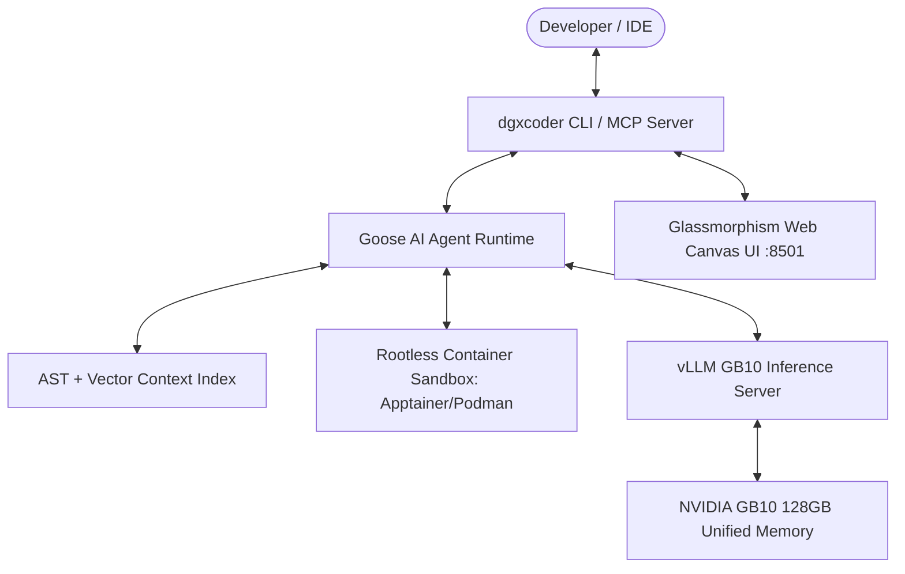

<div align="center">

# 🚀 DGXCoder

### **The Autonomous Local Agentic Pair Programmer for NVIDIA GB10**

[](https://nvidia.com)
[](https://github.com/aaif-goose/goose)
[](https://github.com/vllm-project/vllm)
[](LICENSE)
[](https://dgxcoder.github.io/dgxcoder)
[](tests/)

<p align="center">
  <b>100% Air-Gapped. Zero Data Egress. Blazing Fast Speculative Decoding. Enterprise Container Sandboxing.</b>
</p>

---

</div>

## 🌟 What is DGXCoder?

**DGXCoder** is a state-of-the-art, open-source local AI pair programmer designed specifically to harness the massive **128 GB Unified LPDDR5X Memory** architecture of single-node **NVIDIA GB10 (Blackwell)** systems. 

Powered by the **AAIF Goose Agentic Engine** and **vLLM Dual-Model Speculative Decoding**, DGXCoder turns your local GB10 workstation into an autonomous software engineering powerhouse capable of writing code, running unit tests, refactoring multi-file repositories, and resolving bugs with zero network egress.

---

## 🔥 Features at a Glance

* ⚡ **Dual-Model Speculative Decoding**: Run primary 32B/70B models (`Qwen 2.5 Coder 32B`, `DeepSeek-R1-Distill`) alongside lightweight draft models (`Qwen 2.5 Coder 1.5B/3B`) to achieve **2x–3x faster inference throughput**.
* 🤖 **Goose Agentic Loop**: Built-in supervisor that auto-provisions and orchestrates the official **AAIF Goose v1.45+** AI agent runtime out of the box.
* 🛡️ **Rootless Container Sandboxing**: Isolate subagent tool executions (shell commands, package installs, test runs) using **Apptainer**, **Podman**, or **Docker** rootless containers.
* 📚 **Zero-Egress AST Context Engine**: Air-gapped code intelligence combining AST symbol parsing (classes, functions, signatures) with TF-IDF semantic vector search (`.dgxcoder/context_index.json`).
* 🔌 **IDE Companion MCP Server**: Native stdio **Model Context Protocol (MCP)** server providing real-time linter diagnostics, active editor sync, and diff proposals for **JetBrains** & **VS Code**.
* 🎨 **Glassmorphism Web Canvas UI**: Interactive browser pane (`http://localhost:8501`) featuring live Mermaid.js architecture diagrams, streaming code diffs, and real-time GB10 memory telemetry.

---

## ⚡ Quickstart (Instant Setup)

### 1-Line Automatic Installer:
```bash
curl -fsSL https://raw.githubusercontent.com/dgxcoder/dgxcoder/main/scripts/install_gb10.sh | bash
```

### Launch Interactive Pair Programming:
```bash
# Initializes workspace, auto-launches local vLLM server, and starts Goose agent session
dgxcoder chat
```

---

## 🖥️ NVIDIA GB10 Model Qualification Matrix

All supported models are qualified to run on a single **NVIDIA GB10 System (128 GB Unified Memory)**:

| Model Alias | Parameters | Precision | Memory Required | Hardware Qualification |
| :--- | :--- | :--- | :--- | :--- |
| **`qwen2.5-coder-32b`** | 32B | BF16 / FP8 | ~35 - 64 GB | ✅ Fits comfortably in 128GB Unified Memory |
| **`qwen2.5-coder-72b`** | 72B | INT8 / FP8 | ~45 - 80 GB | ✅ Supported (Quantized fit) |
| **`deepseek-r1-distill-32b`** | 32B | BF16 / FP8 | ~35 - 64 GB | ✅ Fits comfortably in 128GB Unified Memory |
| **`deepseek-r1-distill-70b`** | 70B | INT8 / FP8 | ~45 - 80 GB | ✅ Supported (Quantized fit) |
| **`llama-3.3-70b`** | 70B | FP8 | ~75 GB | ✅ Supported (Quantized fit) |
| **`qwen2.5-coder-1.5b`** | 1.5B | BF16 | ~3.5 - 6 GB | ✅ Ideal Speculative Decoding Draft Model |
| **`qwen2.5-coder-3b`** | 3.0B | BF16 | ~6.5 - 10 GB | ✅ Ideal Speculative Decoding Draft Model |
| **`starcoder2-15b`** | 15B | BF16 / FP16 | ~20 - 30 GB | ✅ Fits easily |
| `deepseek-v3-671b` | 671B | INT4 | ~350 GB | ❌ Exceeds 128GB (Requires multi-node) |

---

## 🛠️ CLI Suite & Commands

```bash
# 1. Initialize project workspace & Goose agent configuration
dgxcoder init --model qwen2.5-coder-32b --draft-model qwen2.5-coder-1.5b

# 2. Launch interactive pair-programming session (Auto-launches vLLM if offline)
dgxcoder chat --debug

# 3. Run autonomous coding task non-interactively
dgxcoder run "Refactor database pool to use async pg" --sandbox apptainer

# 4. Check GB10 memory telemetry & vLLM health
dgxcoder status

# 5. Launch local vLLM GB10 server with Speculative Decoding
dgxcoder serve --model qwen2.5-coder-32b --draft-model qwen2.5-coder-1.5b --port 8000

# 6. Index codebase AST & vector context
dgxcoder index --force

# 7. Start Web Canvas UI
dgxcoder web --port 8501
```

---

## ⚙️ Configuration & Precedence

DGXCoder uses a **4-Tier Configuration Hierarchy**:
1. **CLI Flags**: `--config`, `--model`, `--draft-model`, `--sandbox` *(Highest Priority)*
2. **Environment Variables**: `DGXCODER_MODEL`, `DGXCODER_DRAFT_MODEL`, `DGXCODER_SANDBOX`
3. **Config File**: `.dgxcoder/config.yaml` or `~/.config/dgxcoder/config.yaml`
4. **Built-in System Defaults** *(Lowest Priority)*

### Example `.dgxcoder/config.yaml`:
```yaml
vllm_host: http://localhost:8000
model: qwen2.5-coder-32b
draft_model: qwen2.5-coder-1.5b
num_speculative_tokens: 5
sandbox: apptainer
```

---

## 🏗️ Architecture Overview



---

## 📜 License

Distributed under the **Apache 2.0 License**. See `LICENSE` for details.

---

<div align="center">
  <b>Built with ❤️ for NVIDIA GB10 & Blackwell AI Workstations</b>
</div>
