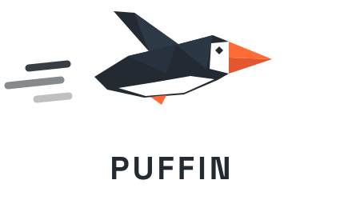

<div align="center">

<picture>
  <source media="(prefers-color-scheme: dark)" srcset="images/puffin-logo-dark-outlined.svg">
  
</picture>

### Your own AI coding agent. On your desk. Nothing leaves.

Puffin turns an NVIDIA DGX Spark, or any GB10 machine, into a private AI that codes, searches and
answers for you, with no cloud, no account, no API bill and no telemetry.<br>
**Don't take our word for it: one command traces every packet and shows you.**

[](https://github.com/dreamference/puffin/releases/latest)
[](docs/privacy.md)
[](docs/getting-started.md)
[](LICENSE)

</div>

```bash
curl -fsSLO https://github.com/dreamference/puffin/releases/latest/download/install.sh && bash install.sh
puffin-admin server start
cd ~/my-project && puffin "find out why the login test is flaky and fix it"
```

Three commands. Your code, your prompts and your answers never leave the machine they're on.

---

## 🔒 Confidential, and you can prove it

Cloud coding agents send your source code to someone else's servers on every keystroke that
matters. Puffin sends it nowhere: the model runs on your GB10, and nothing in Puffin phones home.
No usage analytics, no metrics, no sign-in, no "anonymous" crash reports.

Every claim on this page is checkable. This command runs a real Puffin session under `strace` and
lists every network connection it made:

```console
$ puffin-admin audit egress
✅ Egress audit: pass
Network destinations:
   127.0.0.1:8000             29x  model server
   127.0.0.1:8767              1x  Gmail search service
DNS queries: none
Networked git commands: none
```

Everything stayed on `127.0.0.1`. Not one DNS lookup.

**Need a hard guarantee?** Type `/airgapped on` and every command the agent runs gets an empty
network namespace from the Linux kernel. It's not a polite instruction to the model: there is
simply no network to reach. Full Access, which would bypass the sandbox, is refused at the same
time. [Privacy & security →](docs/privacy.md)

## ⚡ Fast, with no rate limits

| Single stream on a GB10 | |
|---|---|
| Code | **50 tokens/s** |
| JSON | **87 tokens/s** |
| Prose | **25 tokens/s** |
| Reading your code (prefill) | **~1,700 tokens/s** |
| Context window | **262K tokens** |

A small drafter model proposes 16 tokens at a time and the main model checks them in one pass,
which is why code and structured output come out fastest. Run four agents at once and they all keep
going: no quota, no "please wait", no bill at the end of the month. The model is Qwen3.8-27B in
NVIDIA's 4-bit NVFP4 format, tuned for the GB10's Blackwell GPU. [Models →](docs/models.md)

## ✨ Easy, from first install to the hundredth session

- **One installer.** It picks the right role for the machine, checks every download against the
  release's checksums, and prints each `sudo` command before running it.
- **No tuning.** Picking a model picks its whole server recipe: context length, memory share,
  kernels, speculative decoding.
- **It won't freeze your machine.** On a GB10 the GPU and the system share one pool of memory, and
  an oversized model load can lock up the whole box. Puffin checks the host before loading and
  watches memory pressure during the load, killing the container before the machine stalls.
- **Your laptop finds it.** Run `puffin-admin node enable` on the GB10, install the client on any
  Linux machine on the same network, and `puffin` finds the GB10 by itself. No IP addresses to type.
- **Updates are one command:** `puffin update`.

## What you get

| | |
|---|---|
| 🖥️ **`puffin`, the terminal agent** | Reads your repository, runs commands and tests, edits code, and asks before anything risky. [More →](docs/puffin.md) |
| 🌙 **Night Shift** | Queue tasks with `/night add` before bed. Puffin works through them overnight, each on its own git branch, and you review the branches over coffee. |
| 🔎 **Web search and fetch** | Through a private SearXNG on your own machine, so no search engine sees an account or an API key. |
| 🧭 **A code index** | Definitions, callers and impact across your repository, so the agent finds code instead of grepping for it. |
| 🧩 **Your existing skills** | Skills you already wrote for Claude Code, Gemini CLI, OpenClaw or Hermes work in Puffin with no changes. |
| 💬 **Web chat** | A browser assistant with web search, voice input and image understanding, on the same local model. [More →](docs/web-chat.md) |
| 🪟 **Desktop app** | The chat in a window of its own, plus a Work window (preview) that drives agent sessions with approvals, diffs and undo. [More →](docs/desktop.md) |
| 📬 **Gmail, Drive, Calendar** (preview) | Read-only, connected through a sign-in that stays on your machine. Switched off entirely at `/airgapped on`. |

## Puffin and cloud coding agents

| | Cloud coding agents | Puffin |
|---|---|---|
| Where your code goes | Their servers | Nowhere |
| Account needed | Yes | No |
| Cost per token | Metered | Zero |
| Rate limits | Yes | No |
| Works with the network unplugged | No | Yes |
| Can you verify what leaves | No | `puffin-admin audit egress` |

## Runs on every GB10

NVIDIA DGX Spark · Acer Veriton GN100 · ASUS Ascent GX10 · Dell Pro Max with GB10 · Gigabyte AI TOP
ATOM · HP ZGX Nano · Lenovo ThinkStation PGX · MSI EdgeXpert

They share the chip, the 128 GB of unified memory and DGX OS 7, so one installer covers them all.
Puffin is developed and tested daily on the ASUS Ascent GX10; the others are covered by tests.
Windows on Arm laptops (RTX Spark) are planned: [the spec](specs/DREAMFERENCE_PUFFIN_WINDOWS_ARM.md).

## Quick start

**You need** a GB10 machine with the OS it ships with (DGX OS 7, or Ubuntu 24.04 where the vendor
offers it), Docker with the NVIDIA Container Toolkit, Python 3 and Git. On plain Ubuntu,
`puffin-admin host check` tells you what's missing. The first start downloads about 20 GB of model
weights.

```bash
curl -fsSLO https://github.com/dreamference/puffin/releases/latest/download/install.sh
bash install.sh                      # it's short, read it first if you like
puffin-admin server start            # checks the host, downloads and loads the model
cd ~/my-project && puffin            # start working
```

On any other Linux machine the same script installs the client, which uses your GB10 over the
network. The full walkthrough, including the web chat and the desktop app, is in
[Get started](docs/getting-started.md).

<details>
<summary><b>What does reach the network, and when</b></summary>

Local isn't the same as air-gapped, and Puffin doesn't pretend otherwise. These are the only things
that leave the machine, and each one happens because you or the agent asked for it:

| When | What is sent | To |
|---|---|---|
| Installing, first model start | Container images, packages, model weights | Docker registries, PyPI, Hugging Face, GitHub |
| The agent or chat searches the web | The search query | Search engines, through SearXNG on your machine |
| The agent fetches a page | A request for that URL | That website |
| You connect Gmail, Drive or Calendar | Read-only requests | Google |
| You run `puffin update` | A release check and download | GitHub |

A search query is written by the model and can contain fragments of your context. At
`/airgapped on` none of these happen: no search, no fetch, no mail, only the model on your machine.

</details>

<details>
<summary><b>Models</b></summary>

| Alias | Model | Precision | Memory |
|---|---|---|---|
| **`qwen3.8-27b-nvfp4-dflash2`** (default) | Qwen3.8-27B with DFlash2 speculative decoding, served by SGLang | NVFP4 | 20 – 70 GB |
| `qwen3.5-122b-a10b-hybrid-dflash` | Qwen 3.5 122B-A10B with DFlash speculative decoding | INT4 + FP8 | 71.5 – 120 GB |
| `qwen3.5-122b-a10b-int4-dflash` | Qwen 3.5 122B-A10B with DFlash | INT4 | 71.5 – 120 GB |
| `qwen3.5-122b-a10b-nvfp4` | Qwen 3.5 122B-A10B | NVFP4 | 78 – 120 GB |
| `qwen3.6-35b-a3b-nvfp4` | Qwen 3.6 35B-A3B | NVFP4 | 25 – 60 GB |

The 122B models need a custom vLLM image built from [`Dockerfile.dflash`](Dockerfile.dflash) and
[`Dockerfile.dense`](Dockerfile.dense). [All models →](docs/models.md)

</details>

<details>
<summary><b>Configuration</b></summary>

Every setting resolves the same way: command-line flag, then `DREAMFERENCE_*` environment variable,
then `dreamference.toml` (in the project, then `~/.config/dreamference/config.toml`), then the
built-in default.

```toml
# dreamference.toml
vllm_host = "http://localhost:8000"
model = "qwen3.8-27b-nvfp4-dflash2"
puffin_airgapped = "on"     # every session starts air-gapped
puffin_gmail = false        # never offer Gmail to the agent
```

The same model server also drives Cline, Continue and OpenHands:
`puffin-admin run --agent cline "add type hints to utils.py"`.

</details>

<details>
<summary><b>Build from source</b></summary>

```bash
git clone --recurse-submodules https://github.com/dreamference/puffin.git puffin
cd puffin
python3 -m venv .venv && .venv/bin/pip install -e .
export PATH="$PWD/.venv/bin:$PATH"   # the agent runs puffin-admin, so keep it on PATH

puffin-admin host setup              # swap, kernel settings, out-of-memory guard
puffin-admin server start            # checks the host, downloads and loads the model
puffin-admin codex build             # compiles puffin and links it into ~/.local/bin
cd ~/my-project && puffin
```

`puffin-admin` is the Python package that runs the model server, the web chat and the builds
([command reference](docs/admin.md)); `puffin` and its web and code-index tools are Rust. Tests need
no GPU or Docker: `.venv/bin/python -m pytest tests/`. Design specs are in [`specs/`](specs/README.md),
and [How it works](docs/architecture.md) explains the pieces.

</details>

## Contributing

Issues and pull requests are welcome, especially recipes for new models on the GB10 and anything
the egress audit turns up. **If you believe your code should stay on your desk, star the repo:** it
helps other GB10 owners find Puffin.

## Credits

Puffin's terminal agent is built on the open-source [Codex CLI](https://github.com/openai/codex)
(Apache 2.0), with its own launcher, sandbox rules and network hardening on top. It also stands on
[SGLang](https://github.com/sgl-project/sglang), [vLLM](https://github.com/vllm-project/vllm),
[Onyx](https://github.com/onyx-dot-app/onyx), [SearXNG](https://github.com/searxng/searxng) and the
[Qwen](https://github.com/QwenLM) models. Thank you to all of them.

## License

Copyright (C) 2026 Dreamference contributors.

Puffin is free software under the **GNU Affero General Public License v3** or later; the full text
is in [`LICENSE`](LICENSE). Section 13 is the clause that matters for a fork: if you run a modified
Puffin and let people use it **over a network**, you must offer them its source.

This covers Puffin's own code. The components it deploys keep their own licences: Codex (Apache
2.0), SGLang and vLLM (Apache 2.0), Onyx (its own terms, including an `ee/` directory that is not
free software and that Puffin leaves switched off), and each model under its own weights licence.

NVIDIA, GB10, DGX and DGX Spark are trademarks of NVIDIA Corporation. OpenAI and Codex are
trademarks of OpenAI. Qwen is a trademark of Alibaba Cloud. Puffin and Dreamference are not
affiliated with, sponsored by or endorsed by any of them; the names say only what Puffin runs on and
is built from.
