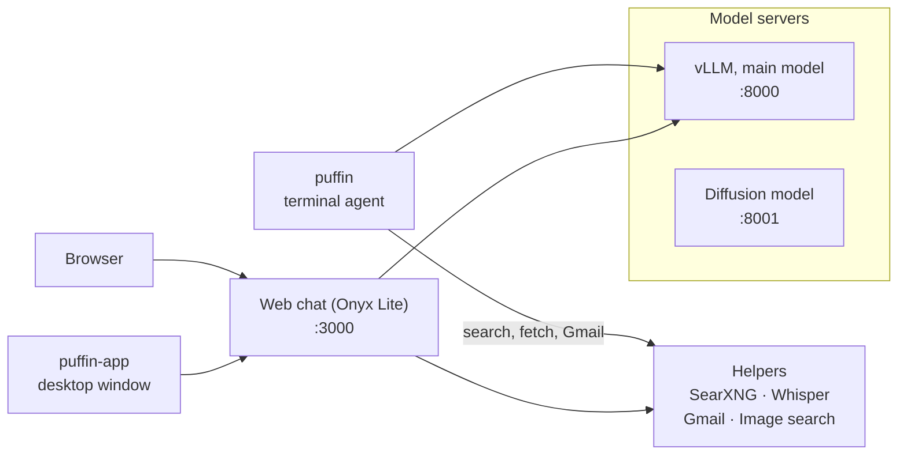
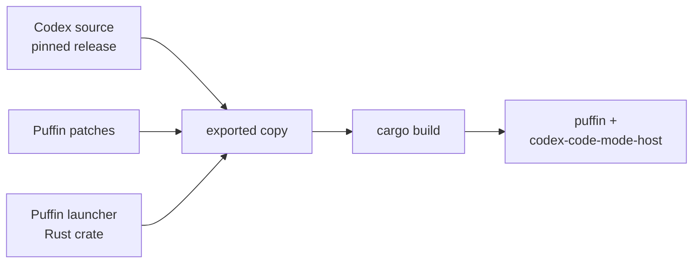

# Architecture

Puffin is a set of local services around one model server. Everything below runs on the GB10.

The engine underneath is called **Dreamference**. That is why settings and paths are named
`dreamference.toml`, `DREAMFERENCE_VLLM_HOST` and `~/.local/share/dreamference/`. Puffin is the
product built on it.

| Part | What it is | Where it runs |
|---|---|---|
| Model server | vLLM serving the main model through an OpenAI-compatible API | Docker container, port 8000 |
| Diffusion model | A small code-diffusion model with its own OpenAI-compatible API | Docker container, port 8001, capped at 8 GB |
| `puffin` | The terminal agent, a patched build of the Codex CLI | A native binary, linked from `~/.local/bin` |
| Web chat | Onyx Lite: web server, API server, PostgreSQL | Docker containers, port 3000 |
| SearXNG | Metasearch: queries public search engines for web search | Docker container, reachable only from this machine |
| Whisper | Speech-to-text for the microphone button, on the CPU | Docker container |
| Gmail service | Read-only IMAP search over connected Gmail accounts | Docker container, reachable only from this machine |
| Image search | Finds and serves images for the web chat | Docker container |
| `puffin-app` | A Tauri window showing the web chat | Native app |
| `puffin-admin` | Manages all of the above | Python CLI |

The web chat reaches the model server through Docker's bridge network, because the model server
shares the host's network while Onyx runs on Docker's default bridge. `configure` sets that up.

## How `puffin` is built

- **Pinned source.** The Codex source sits in the repository pinned to a stable release, and is
  never edited.
- **Built from a copy.** `puffin-admin codex build` exports that release to a scratch directory,
  adds Puffin's launcher crate, applies a short series of patches, and compiles.
  - The patches are small: the product name in the interface, and one-line hooks into the launcher.
  - The rest of Puffin's changes live in the launcher: finding the model, the prompt, and the
    removed OpenAI-only commands.
- **Easy to upgrade.** Moving to a newer Codex release is a change of pin plus refreshing whichever
  patches stop applying.
- **Two programs.** The build produces `puffin` and `codex-code-mode-host`, the helper that runs
  the agent's Code Mode JavaScript in its own V8 engine. They are installed side by side.
- **Rebuilt only when needed.** A build is recorded against the exact source, patches and launcher
  it came from, so an unchanged tree is not rebuilt.

## Keeping the host alive

On the GB10 the GPU and the operating system share one pool of memory. A model load that
overshoots doesn't just fail: it can push the whole machine into a stall. Puffin guards against
that in two layers:

1. **Before a load.** `puffin-admin server start` inspects swap, kernel memory settings and whether
   an out-of-memory guard (`earlyoom` or `systemd-oomd`) is present and configured. If loading
   could freeze the host, it stops and explains what to change.
2. **During a load.** A watchdog samples the kernel's memory-pressure signal (PSI) every
   second. If pressure spikes, or stays high, it kills the model container before the host stalls,
   through the fastest route the host can still take.

The diffusion model uses a fixed memory cap instead. It is small enough that a contained
out-of-memory kill is the worst case.
