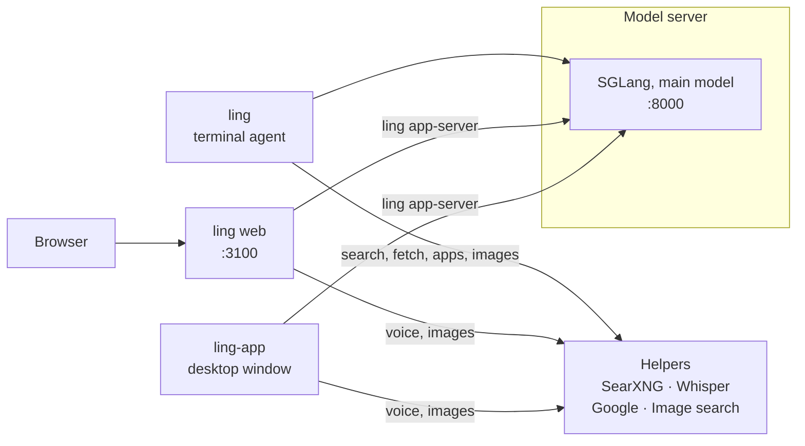
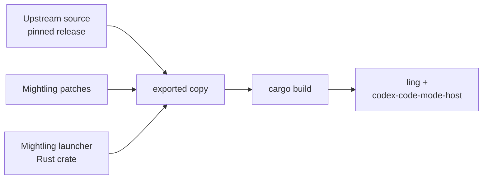

# Architecture

Mightling is a set of local services around one model server. Everything below runs on the GB10.

Mightling is made by **Dreamference**, and its Python side is the `dreamference` package. That is why
settings and paths are named `dreamference.toml`, `DREAMFERENCE_VLLM_HOST` and
`~/.local/share/dreamference/`.

| Part | What it is | Where it runs |
|---|---|---|
| Model server | SGLang (or vLLM) serving the main model through the standard `/v1` chat API | Docker container, port 8000 |
| `ling` | The terminal agent | A native binary, linked from `~/.local/bin` |
| `ling web` | Ask and Work in a browser, relayed to `ling app-server` | Part of `ling`, port 3100 |
| SearXNG | Metasearch: queries public search engines for web search | Docker container, reachable only from this machine |
| Whisper | Speech-to-text for the microphone button, on the CPU (`ling-admin voice start`) | Docker container, reachable only from this machine |
| Google service | Read-only Gmail, Drive and Calendar for `/apps` | Docker container, reachable only from this machine |
| Image search | Finds images for the `image_search` tool and keeps them on this machine (`ling-admin images start`) | Docker container, reachable only from this machine |
| `ling-app` | An Electron window showing Ask and Work, with its own `ling app-server` | Native app |
| `ling-admin` | Manages all of the above | Python CLI |

The sidecars share one Docker network, `dreamference-sidecars`; image search reaches the model
server through the host's bridge address, because the model server shares the host's network. The
Onyx web chat that used to sit on port 3000 is retired.

## How `ling` is built

- **Pinned source.** The source Mightling was forked from sits in the repository pinned to a stable
  release, and is never edited in place.
- **Built from a copy.** `ling-admin codex build` exports that release to a scratch directory,
  adds Mightling's launcher crate, applies a short series of patches, and compiles.
  - The patches are small: the product name in the interface, and one-line hooks into the launcher.
  - The rest of Mightling's changes live in the launcher: finding the model, the prompt, and the
    removed cloud-only commands.
- **Easy to upgrade.** Moving to a newer upstream release is a change of pin plus refreshing
  whichever patches stop applying.
- **Two programs.** The build produces `ling` and `codex-code-mode-host`, the helper that runs
  the agent's Code Mode JavaScript in its own V8 engine. They are installed side by side.
- **Rebuilt only when needed.** A build is recorded against the exact source, patches and launcher
  it came from, so an unchanged tree is not rebuilt.

## Keeping the host alive

On the GB10 the GPU and the operating system share one pool of memory. A model load that
overshoots doesn't just fail: it can push the whole machine into a stall. Mightling guards against
that in two layers:

1. **Before a load.** `ling-admin server start` inspects swap, kernel memory settings and whether
   an out-of-memory guard (`earlyoom` or `systemd-oomd`) is present and configured. If loading
   could freeze the host, it stops and explains what to change.
2. **During a load.** A watchdog samples the kernel's memory-pressure signal (PSI) every
   second. If pressure spikes, or stays high, it kills the model container before the host stalls,
   through the fastest route the host can still take.
