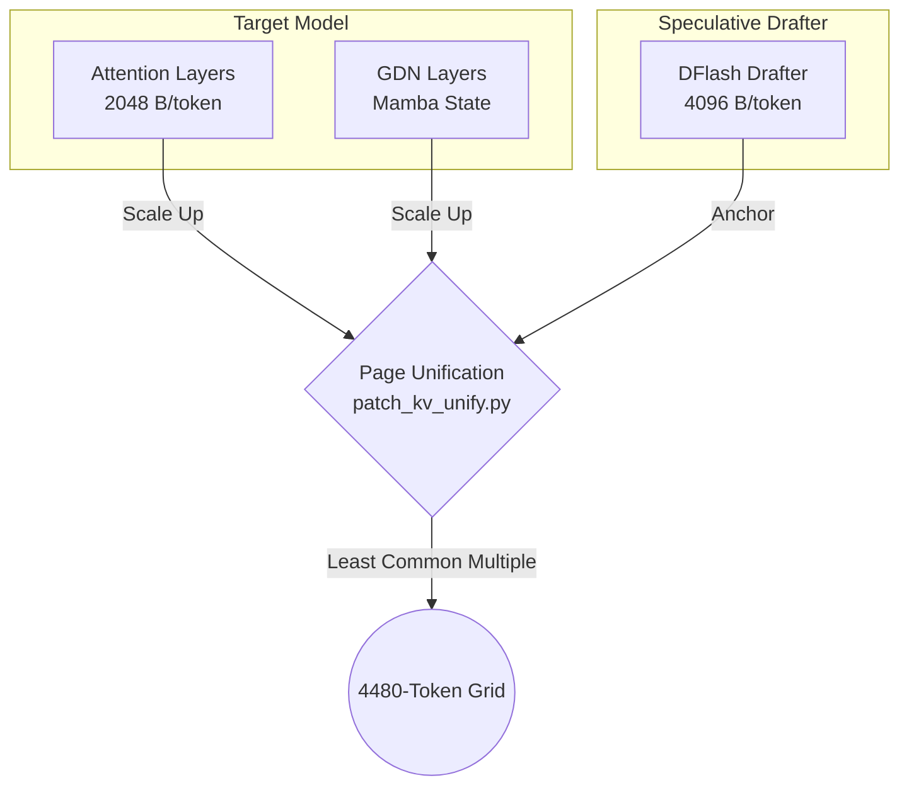
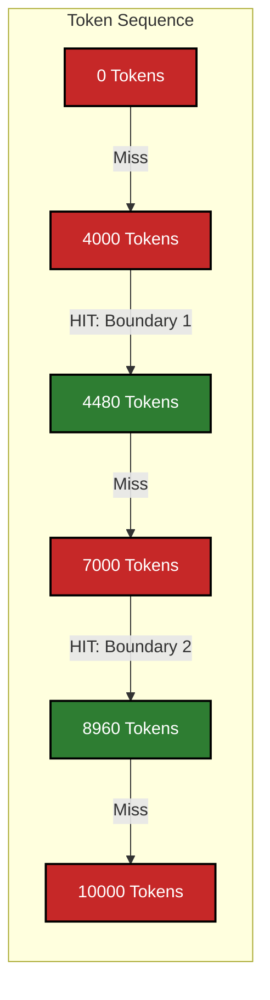

# Prefix Caching on the Hybrid GDN + DFlash Stack — Findings and Patch Design

**Status:** v5 — Deployed (`dense5` with region-adaptive chunking + 9048 budget for hybrid; `enable_prefix_caching: False` for int4 fallback)

**Date:** 2026-08-24
**Patch:** `runtime/patch_mamba_chunk_align.py`
**Registry context:** `qwen3.5-122b-a10b-hybrid-dflash` (image `dreamference-vllm-dflash:0.23.0-aeon-dense5`) / `qwen3.5-122b-a10b-int4-dflash` (image `dreamference-vllm-dflash:0.23.0-aeon-kvfix2`)

---

## 1. How Prefix Caching Works on this Stack

Before diving into the defects and patches, it is critical to understand how prefix caching operates on the **Hybrid GDN + DFlash** architecture, as it fundamentally differs from standard attention models.

### 1.1 The Three KV Groups & Page Unification

This stack must maintain KV cache for three distinct components simultaneously. Because the DFlash speculative drafter requires 2x the space per token, the engine forces a "page unification" step (`patch_kv_unify.py`). It scales the target's attention and GDN blocks up to match the drafter's page size, resulting in a strict **4480-token grid**.



### 1.2 Mamba `align` Mode & Full State Materialization

Because Qwen's GDN layers do not natively support full state materialization (`SupportsMambaPrefixCaching` is missing), vLLM is forced to run in `align` mode. This means it cannot save the GDN state for every single token. It only saves **one state slot at the very end of a scheduling step**.

#### What it would take to fix this (Enabling `all` mode)
To support full state materialization, two massive upstream engineering tasks are required:
1. **GPU Kernel Rewrite:** The underlying FLA (Flash Linear Attention) CUDA/Triton kernels must be rewritten. Currently, they compute the GDN state in fast SRAM and only write to Global Memory at the end of the sequence. They must be modified to pause at every KV block boundary and write the intermediate state out to memory.
2. **vLLM Integration:** The Python model executor must pass the full block table to the new kernel, giving it the exact pointers for every block, and inherit the `SupportsMambaPrefixCaching` trait so vLLM knows it can enable `all` mode.

#### The Fatal Catch: Memory Explosion
Even if the kernel is rewritten, enabling `all` mode triggers a physics problem. While standard Attention KV cache is small (kilobytes per token), a single fixed GDN state for all 36 layers of Qwen 122B is massive—roughly **~157 MB**. 

```mermaid
graph TD
    subgraph "align" Mode (Current)
        A[10,000 Token Prompt] -->|One state per step| B(Single GDN State<br/>~157 MB)
    end
    
    subgraph "all" Mode (Full Materialization)
        C[10,000 Token Prompt] -->|State per block| D(Block 1: 157 MB)
        C -->|State per block| E(Block 2: 157 MB)
        C -->|State per block| F(Block N: 157 MB...)
        D -.-> OOM
        E -.-> OOM
        F -.-> OOM
        OOM((Fatal OOM Crash<br/>~94 GB VRAM Cost))
    end
    
    classDef danger fill:#c62828,stroke:#000,stroke-width:2px,color:#fff;
    class OOM danger;
```

In `align` mode, vLLM only stores one 157 MB state per request. If `all` mode were enabled, storing a 157 MB state for *every single block* would instantly consume ~94 GB of VRAM for a single 10,000-token prompt, causing an inevitable Out-Of-Memory (OOM) crash on almost any GPU. The strict grid in `align` mode is a necessary compromise to keep the memory footprint survivable.

### 1.3 The Boundary Rule

For a prefix cache hit to occur, a prefill chunk MUST end exactly on a 4480-token boundary. 



*(Example: If two agents read the exact same 4,000-token prompt, they get **zero cache hits** because the sequence didn't reach the 4480 boundary. If they share 10,000 tokens, they hit exactly at 8960).*

### 1.4 Memory Footprint: What Percentage of the Cache is GDN?

Understanding the physical memory footprint explains why the cache operates this way. 

The total KV Cache pool on this stack is roughly **~13 GiB**. Here is how the memory is distributed:

* **Target & Drafter Attention:** This consumes the vast majority of the pool. Attention KV scales with tokens (roughly ~121 KB per token across all layers), meaning a 10,000-token prompt consumes about ~1.2 GB of Attention KV.
* **GDN (Mamba) Cache:** A single complete GDN state across all 36 GDN layers is roughly **157 MB** (about 4.36 MB per layer). 

**The Percentage in `align` Mode (Current State):**
Because `align` mode only stores **one** GDN state slot per active request, if you have 8 concurrent agents running, the total GDN footprint is `8 sequences × 157 MB = ~1.25 GB`. 
Against the ~13 GB total pool, the GDN cache currently consumes **less than 10%** of the total cache memory. The other 90%+ is dedicated entirely to the Attention KV.

**The Percentage in `all` Mode (The Fatal Hypothetical):**
If `all` mode were enabled and forced to save a 157 MB GDN state for *every single 16-token block* (standard vLLM block size), a 10,000-token prompt would generate 625 blocks. 
`625 blocks × 157 MB = ~98 GB` of GDN state for just one prompt. In this scenario, the GDN cache would consume **100% of the KV pool and immediately crash the server**, which is why `align` mode restricts it to a single slot (less than 10%).

### 1.5 Decoupling the Caches: Pros and Cons

A common architectural question is why vLLM unifies these caches via `HybridKVCacheCoordinator` instead of splitting the **Target Attention**, **Target GDN**, and **Drafter** caches into three completely independent processing frameworks.

If the engine were rewritten to decouple them, the trade-offs would be:

#### The Pluses (Pros)
1. **Decoupled Grid Sizes (Granularity):** Target Attention would no longer be forced into the massive 4480-token grid required by the Drafter and GDN. It could return to a standard 16-token grid.
2. **Hit Rate Maximization:** A 4,000-token sequence would no longer result in a "zero hit" just because it missed the GDN 4480 boundary. The Attention cache could hit at exactly 4,000 tokens, the Drafter cache could hit at 4,000, and only the GDN cache would miss.
3. **Memory Efficiency (No Padding):** Page unification forces the Target's blocks to scale up to match the Drafter. Independent frameworks would eliminate this padding, returning gigabytes of wasted space to the KV pool.

#### The Minuses (Cons)
1. **Divergent Engine State (Coordination Hell):** This is the fatal flaw. If Attention hits at 4,000 tokens but GDN misses (0 hits), the engine must run a "partial prefill". It would have to compute the GDN layers from token 0 to 4000, while somehow telling the Attention layers to sleep during that exact same span. This shatters the sequential forward pass.
2. **Kernel Incompatibility:** vLLM's low-level CUDA kernels (like PagedAttention) are designed to process all layers of a sequence synchronously. The kernels lack the ability to selectively mask out specific layers based on cache hit divergence.
3. **3x CPU Bookkeeping Overhead:** The Python scheduler would have to maintain three independent BlockTables, three LRU eviction queues, and three hash maps for every single sequence. This tripling of bookkeeping would likely cause CPU bottlenecks during high-concurrency routing.

Because of the "Coordination Hell," vLLM forces unification: a sequence is only considered a cache hit if **all three groups** hit at the exact same token boundary.

### 1.6 Prefix Caching Dynamics: Client-Side Usage

A common question is how clients interact with this cache. **Prefix caching is 100% automatic and transparent to the client.**

* **No Explicit Flags Required:** Unlike some commercial APIs (e.g., Anthropic's `ephemeral` cache tags), the client does not need to explicitly ask the server to cache a prompt. 
* **Automatic Hashing:** Under the hood, vLLM hashes the token IDs of every incoming request starting from token 0. If it finds a matching hash in the KV pool (and it aligns with the 4480-token boundary rule), it automatically skips the computation for those blocks and instantly restores the state.
* **LRU Eviction (Opportunistic Caching):** When a request finishes generating, its KV blocks are "freed," but vLLM does not delete them. It leaves the hashed blocks in the GPU memory. They are only evicted (overwritten) on a Least Recently Used (LRU) basis when the engine runs completely out of free blocks for new requests.

**The Golden Rule for Clients:**
Because caching is sequential starting from token 0, the client **must** place all shared, reusable context at the absolute beginning of the prompt.
If a client inserts a changing string (such as the current time, a unique conversation ID, or the user's new question) *before* the massive 10,000-token system prompt, the hash chain is instantly broken at token 0, and **0% of the prompt will be cached**. 

Always structure prompts as: `[Static System Instructions] -> [Static Documents/Context] -> [Dynamic Conversation History/New User Question]`.

#### The Long-Running Chat: Should Old Entries Be Deleted?

Consider a long-running chat that reaches 15,000 tokens. As it grew, the engine created cache checkpoints at the 4480, 8960, and 13440 boundaries. Does it make sense to delete the older 4480 entry once the 8960 entry is created?

**For the System Prompt (No):**
Absolutely not. The 4480 boundary usually contains the static system prompt, core tool definitions, or shared RAG documents. If you delete the 4480 entry, the *next* agent or chat session that starts with that identical system prompt—but asks a completely different question—will suffer a total cache miss and have to recompute from token 0. You want to preserve these early blocks indefinitely because they have a massive reuse rate across multiple concurrent users.

**For the Chat Tail (Yes, but LRU handles it):**
As the chat progresses to 13440 tokens, that specific checkpoint contains the unique back-and-forth history of *one specific conversation*. No other session will ever match its hash. While it might seem efficient to aggressively delete the intermediate 8960 block once 13440 is reached, vLLM relies on its **Least Recently Used (LRU)** eviction policy to handle this naturally.
When the GPU's memory fills up, the LRU algorithm automatically overwrites the blocks that haven't been requested recently. The unique "chat tail" blocks from abandoned or finished conversations naturally get evicted, while the 4480-token "system prompt" blocks are constantly "touched" by new incoming requests, keeping them immortalized in the cache.

*(Note: vLLM's current MambaManager actually does try to free previous GDN states mid-request, relying entirely on the LRU queue to keep them alive opportunistically. See Roadmap Section 6.2 for why we might want to patch this to keep them strictly alive).*

### 1.7 Architectural Contrast: Hybrid vs. Pure Attention (Nemotron)

A frequent question is whether pure-Attention models (like `Llama-3.1-Nemotron-70B`) handle prefix caching better than this Qwen Hybrid stack. The answer is **yes, vastly better and simpler**, but with a long-context trade-off.

Because Nemotron lacks GDN (Mamba) layers, it bypasses "Coordination Hell" entirely. It uses standard PagedAttention, which natively caches in tiny, highly efficient **16-token blocks**.
* **No Grid Lock-in:** A cache hit can happen precisely at token 16, 32, 48, etc., instead of waiting for a massive 4480-token boundary.
* **No 157 MB Checkpoints:** It only stores standard KV tensors, which take up very little space per token, avoiding massive spikes in LRU cache pressure.
* **Zero Unification Waste:** Without the need to scale blocks up to match a Drafter's LCM, Nemotron wastes almost zero memory on block padding.

**The Trade-Off:** While Nemotron's caching is infinitely cleaner, pure Attention KV cache *grows linearly* with context size. At 100,000 tokens, a pure Attention model requires massive amounts of VRAM just to hold the active KV cache for a single request. Qwen uses GDN because the GDN state size is *fixed* (~157 MB) whether you are at 1,000 or 100,000 tokens, making it theoretically far more memory-efficient during extreme long-context generation.

### 1.8 Quantifying the Padding Waste: Is it still worth it?

Given that Page Unification forces Attention blocks into massive 4480-token buckets, how much memory is actually wasted, and should prefix caching be disabled to reclaim it?

**The Math on Padding Waste (Internal Fragmentation):**
* As established in Section 1.4, Attention KV requires roughly ~121 KB per token. Therefore, one unified 4480-token bucket consumes **~542 MB** of VRAM.
* Prompts rarely end exactly on a multiple of 4480. If your prompt is 4,481 tokens long, vLLM must allocate a full second bucket (542 MB) just to hold that 1 extra token.
* On average, the final "tail" bucket of any sequence is half-empty, wasting roughly **~271 MB per active sequence**.
* With 8 concurrent agent streams, plus a few older abandoned tails sitting in the LRU queue, the server wastes roughly **2.5 to 3.5 GB of VRAM** globally on empty padding (roughly 20-25% of the ~13 GB KV pool).

**The Verdict: Absolutely DO NOT turn off prefix caching.**
Wasting 3 GB of VRAM on empty padding is a cheap tax to pay for the massive speedup in agentic workflows. Agents operate in loops, repeatedly sending the exact same 10,000-token history back to the model with just a few new tool results appended. 
* **Without Caching:** The GPU must run a full, cold mathematical forward pass on all 10,000 tokens every single step. Time-To-First-Token (TTFT) takes **3 to 5 seconds** while the GPU grinds through historical text.
* **With Caching:** The engine hits the 8960-token boundary, instantly loads the state from memory, and computes only the delta. TTFT drops to **~0.2 seconds**. 

Until vLLM rewrites its kernels to support decoupled hybrid caching natively, paying the 3 GB memory tax is mandatory to keep the engine lightning fast.

### 1.9 Roadmap: Explicit (Opt-In) Client Caching

Currently, vLLM's prefix caching is **100% automatic and global**. Every sequence is hashed and pushed into the LRU pool. However, modifying the engine to support strict **opt-in caching** (where the client explicitly requests caching via an API flag) is a highly recommended, Python-only engineering task that yields massive stability benefits.

**How it would be implemented:**
No low-level CUDA kernels need to be altered. The implementation requires three straightforward Python-layer changes:
1. **API Layer:** Modify the OpenAI-compatible API (`vllm/entrypoints/openai/`) to accept a custom request flag (e.g., `"enable_cache": false`).
2. **Engine Layer:** Pass this boolean down to the `SequenceGroup` object.
3. **Allocator Layer (The Switch):** Inside the `BlockAllocator`, modify the block-freeing logic. Currently, if a block has a hash, it is sent to the LRU Prefix queue. The logic would change to: `if block.has_hash and sequence.enable_cache:`. If the flag is false, the block bypasses the LRU pool entirely and its memory is instantly zeroized/reclaimed for new active requests.

**Why this is critical for production:**
* **Preventing "Cache Thrashing":** In a multi-agent environment, the LRU queue is filled with highly valuable, frequently reused System Prompts. If a user suddenly submits a massive, one-off batch job (e.g., summarizing 50 unique 20,000-token PDFs), the automatic cacher will blindly attempt to cache all of them. This massive influx of useless data will instantly flood the LRU queue, pushing out and destroying the valuable System Prompts. Explicit control allows the PDF job to opt-out, destroying its KV blocks instantly upon completion and protecting the main LRU pool for the agents.
* **Security and Privacy (PII):** If a specific user prompt contains sensitive PII, passwords, or strict-confidentiality text, the client can explicitly opt out of caching to guarantee that no mathematical trace of that text sits dormant in the shared GPU memory pool.

---

## 2. The two defects

Both were found by driving the real `KVCacheManager`/`HybridKVCacheCoordinator` offline inside the pinned image (pure bookkeeping, no GPU) and then confirming against the live server.

### 2.1 Zero hits by design (upstream `align`-mode sparsity)

In mamba cache mode `align` — forced for Qwen3.5's GDN layers, which lack `SupportsMambaPrefixCaching` — the GDN kernel receives exactly **one running-state slot per scheduling step**: `mamba_get_block_table_tensor` gathers the block table down to `(seq_len - 1) // block_size`. Every earlier position in the mamba group's block table is the null block, `cache_full_blocks` skips null blocks, and the hybrid coordinator's `get_cached_block` demands a hit in **every** KV group. Consequence: a prompt that prefills in one chunk stores *nothing* reusable in the mamba group, and any identical re-send misses in that group, which zeroes the whole intersection. This is the measured behaviour: 7.6k-token identical re-sends hit 0 in every configuration ever tested on this stack.

Hits only exist where a prefill chunk *ended* on a reusable boundary. Store and lookup are both quantized to `scheduler_block_size` — the LCM across groups, **4480** here, because page-size unification (`patch_kv_unify.py`) scales the target's attention and mamba blocks 2240 → 4480 to match the DFlash drafter's ~2x page.

### 2.2 Wrong-state hits (introduced by the unify + prefix-align combination)

`Scheduler._mamba_block_aligned_split` exists to make chunk ends land on mamba block boundaries, but it aligns to `cache_config.block_size` (**2240**) — not the unified mamba block (**4480**). A chunk ending at an odd 2240-multiple ends *mid* mamba block: the kernel writes its end-of-step state into slot `(end-1)//4480`, whose nominal boundary is up to 2240 tokens later, and `cache_blocks` then hashes that block under the *boundary's* token hash.

Live demonstration (2026-08-24, exact production config): a 12,323-token first turn chunked as 6720 / 4480 / tail (the splitter's 2240 grid), and the follow-up turn hit 8960 tokens — the first nonzero hit ever observed on this stack. By the slot-write arithmetic, that hit restored **state@6720 from the slot labelled 8960** — the kernel's end-of-step write semantics are inferred from the gathered-table contract (`mamba_get_block_table_tensor`'s docstring and the state-migration comment in `remove_skipped_blocks`), not directly observed. The hit's existence alone does not discriminate, and a fact-recall probe was inconclusive because full-attention KV (cached correctly) covers the gap — so if the state is stale, the damage is a silent degradation of the GDN layers' contribution in long-context multi-turn sessions, not a visible failure. The patch is correct under either resolution: aligning chunks to the LCM is required for the invariant and also unlocks the §2 hit-rate gains. Upstream vLLM never reaches this state: `resolve_kv_cache_block_sizes` refuses mamba blocks that diverge from `cache_config.block_size`, and it is our `patch_prefix_align.py` (ported from the Entrpi recipe) that lets the configuration through. The splitter bug is latent upstream; the enablement made it live.

---

## 3. The patch

**One line, scheduler-side** (`runtime/patch_mamba_chunk_align.py`, sentinel `dreamference-mamba-chunk-align`): `_mamba_block_aligned_split` aligns to `self.block_size` — the scheduler's *resolved* block size, which the engine core computes as the LCM across KV groups and passes in — instead of `cache_config.block_size`.

**At what points are new cache entries created, and how large are they?**
In Mamba `align` mode, a new cache entry (reusable state checkpoint) is created **only at the exact end of a prefill chunk**. 
By patching the chunk splitter to align strictly to the 4480-token LCM grid, this patch forces prefill chunks to end *exactly* at 4480, 8960, 13440 tokens, etc. Because the prefill pauses exactly on those boundaries, vLLM's `align` mode successfully writes a new, reusable GDN cache entry into the pool at every single one of those boundaries.

Each GDN cache entry created at these boundaries has a fixed size of **~157 MB**. This single 157 MB chunk of memory holds the mathematical summary (the recurrent state) of the entire sequence up to that boundary across all 36 GDN layers. 

Why the LCM is the right value in every configuration:

- It is a multiple of every group's block size by construction, so chunk ends always land on mamba block boundaries → the align-mode invariant (slot *i* holds the state at `(i+1)*block_size`) holds, fixing §1.2.
- It equals the coordinator's store-alignment and hit-gate grid, so every checkpoint the splitter forces is also *cacheable and hittable* — with the 2240 splitter, states at odd 2240-multiples (e.g. 6720, 11200) were unreachable even when correct.
- Wherever group sizes agree — every configuration upstream lets through today — `self.block_size == cache_config.block_size` and the patch is a no-op.

### 3.1 Chunk-size economics (no registry change required)

The `max_num_batched_tokens` budget went from 8248 → 9048 for the hybrid entry (exactly two 4480-token blocks). Because the `dense5` image includes a region-adaptive chunking patch, prefill chunks are capped to 1 block (4480) *only* during the first two blocks, ensuring dense checkpoints where shared system prompts live. Deeper prefill runs at the full 9048 budget (two blocks per step) to recover per-step efficiency. The `gpu_memory_utilization` was safely raised to 0.70 to cover the larger activation reserve.

---

## 4. Deployment History

1. `dense2` deployed the `patch_mamba_chunk_align.py` patch.
2. `dense3` deployed the `patch_unify_downscale` patch.
3. `dense5` deployed the region-adaptive `patch_mamba_checkpoint_chunks` patch, enabling the 9048 budget.
4. **Housekeeping:** The `int4-dflash` fallback currently runs on `kvfix2`. Because it lacks the new alignment patches, it would ship the §2.2 stale-hit hazard if caching were enabled. Its `enable_prefix_caching` is therefore explicitly set to `False` in the registry. It will remain off until a patched `kvfix3` image is baked.

---

## 5. What this does not fix (design floor)

- No hits below 4480 shared tokens, and hits remain quantized to the 4480 grid — both follow from one-state-slot-per-step `align` mode plus the LCM. Finer grids are not reachable by configuration: shrinking the grid to 2240 would require un-scaling the target's blocks, which either re-triggers the startup assert `patch_kv_unify.py` exists to fix or doubles attention KV bytes via padding.
- The real fix is upstream: `SupportsMambaPrefixCaching` ('all' mode) for GDN, which materializes every block's state at real memory cost. Out of scope here.

---

## 6. Further patch options (roadmap)

Ranked by value-per-risk on this stack. Geometry fact underpinning #1: the drafter's per-token KV is exactly 2x the target's (8 kv-heads x 128 head-dim = 4096 B vs 2 x 256 = 2048 B, both bf16) — that integer ratio is the whole reason the grid is 4480.

1. **Halve the grid by scaling the drafter's block DOWN (2240 → 1120).** `unify_kv_cache_spec_page_size` only scales smaller-page specs *up* to the max page; with the platform block at 2240 the drafter's page (9.2 MB) becomes the max and the target's attn+mamba scale to 4480. A patch could instead scale the *larger*-page spec's block down when the ratio divides evenly: drafter 2240 → 1120 puts every group at ~4.59 MB pages with blocks {2240, 2240, 1120} → LCM = **2240**. Hit floor and grid halve, checkpoint density doubles, and there is **no capacity cost**.
2. **Stop freeing hash-cached checkpoint blocks mid-request.** `MambaManager.remove_skipped_blocks` frees the previous state block as the sequence advances; freed blocks keep their hash only until the free queue recycles them, which is what makes hits opportunistic. Skipping the free when `block.block_hash is not None` keeps checkpoints alive until normal request teardown.
3. **Recycle-event logging** (one debug line where the pool evicts a hashed block on reuse) — near-zero risk.
4. **Drafter-only fp8 KV** — the other route to a 2240 grid (4096 → 2048 B/token), with a capacity *gain*.
5. **`all`-mode mamba caching for GDN** (the complete fix: every block's state materialised, hits guaranteed rather than opportunistic, no dependence on chunk history). Requires the FLA GDN kernel to write per-block states — it has no `all`-mode machinery today.

---

## 7. Upstream reporting

Two reports worth filing, both with the offline repro:

- **vLLM:** `_mamba_block_aligned_split` uses `cache_config.block_size` where the resolved scheduler block size is meant; latent today (resolve refuses divergent mamba blocks) but wrong the moment that guard is relaxed — as two published DFlash recipes already do.
- **Entrpi (`qwen3.5-122B-A10B-on-spark`):** their `patch_prefix_align.py` + `patch_unify2.py` combination ships the stale-state hit on every deployment; `patch_mamba_chunk_align.py` is the companion fix.
